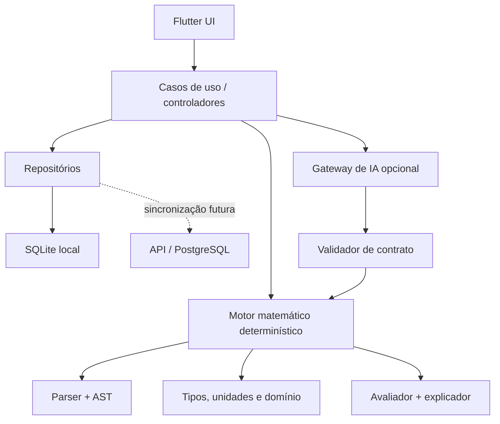

# Arquitetura técnica — Primeiro Radiante

## 1. Direção arquitetural

Flutter entrega a interface e o motor local. A organização será por
funcionalidade, com camadas de apresentação, aplicação, domínio e dados. O
domínio matemático não depende de widgets, banco ou provedor de IA.



## 2. Stack proposta

- Flutter/Dart estável aprovado no início da implementação;
- Riverpod para estado e injeção;
- `go_router` para navegação;
- SQLite via Drift ou equivalente tipado, decisão após spike;
- decimal de precisão definida e biblioteca de unidades avaliadas em spike;
- `CustomPainter` + animações Flutter para o campo dourado;
- isolates para cálculos longos e geração de grafos;
- Supabase/PostgreSQL apenas quando sincronização/autenticação entrar no escopo.

Dependências não devem ser fixadas pela documentação. Antes de adicionar cada
pacote, verificar manutenção, licença, suporte às plataformas e comportamento
numérico.

## 3. Estrutura recomendada

```text
lib/
  app/
    bootstrap.dart
    app.dart
    router.dart
    environment.dart
  core/
    errors/
    logging/
    persistence/
    privacy/
    theme/
    time/
    widgets/
  features/
    radiant_gate/
    calculator/
    projects/
    scenarios/
    visualization/
    assistant/
    settings/
  math_engine/
    ast/
    parser/
    functions/
    numbers/
    units/
    validation/
    evaluation/
    explanation/
```

## 4. Rotas

```text
/gate
/home
/calculo/novo
/projetos
/projetos/:projectId
/projetos/:projectId/cenarios
/projetos/:projectId/visualizacao
/assistente
/funcoes
/configuracoes
```

Ao iniciar, a rota de entrada considera onboarding, preferência acessível e
eventual bloqueio seguro. O estado “gesto concluído” é de sessão e não precisa
ser persistido como credencial.

## 5. Motor matemático

### Pipeline

```text
texto da expressão
  → tokenização
  → parser
  → AST imutável
  → resolução de nomes/funções
  → validação de tipos, unidades e domínio
  → plano de avaliação
  → resultado + passos + avisos
```

### Restrições

- gramática com lista explícita de operadores e funções;
- nenhuma reflexão, `eval`, FFI ou execução de código do usuário;
- limites de tamanho da expressão, profundidade da AST, iterações e tempo;
- detecção de divisão por zero, domínio inválido, overflow e não convergência;
- ordenação topológica e detecção de ciclos entre variáveis;
- números especiais (`NaN`, infinito) nunca são exibidos sem diagnóstico;
- operações não determinísticas registram semente e algoritmo.

### Tipos numéricos

- `integer` para contagens exatas;
- `decimal` para valores que precisam de aritmética decimal previsível;
- `real` de ponto flutuante para funções científicas, com tolerância informada;
- `quantity` para valor + unidade/dimensão;
- vetores e matrizes somente após o núcleo escalar estar validado.

Uma expressão não deve misturar valores monetários e `double` silenciosamente.
Conversões e arredondamentos são operações explícitas e registradas.

### Funções iniciais

- `+`, `-`, `*`, `/`, potência e parênteses;
- `abs`, `min`, `max`, `round`, `floor`, `ceil`;
- `sqrt`, `exp`, `ln`, `log10`;
- `sin`, `cos`, `tan` com radianos/graus explícitos;
- média, mediana, variância e desvio padrão;
- comparação e função condicional controlada em fase posterior do MVP.

## 6. Inteligência artificial

O `AssistantGateway` recebe uma solicitação minimizada e devolve JSON conforme
schema. A camada de aplicação:

1. mostra quais dados serão enviados;
2. remove metadados e nomes não necessários;
3. exige consentimento quando aplicável;
4. valida estrutura, funções, variáveis e limites;
5. apresenta a proposta ao usuário;
6. só então entrega a expressão aprovada ao motor local.

Chaves de provedor não ficam no binário. Em produção, chamadas usam backend
controlado, autenticação, limites e registros sem conteúdo sensível. Falha da IA
não impede o cálculo manual.

## 7. Persistência e sincronização

O repositório local é a fonte de verdade no MVP. Toda alteração em projeto gera
uma revisão imutável ou evento suficiente para auditoria. Operações compostas
usam transação SQLite.

Se a nuvem entrar depois:

- identificadores são UUIDs gerados no cliente;
- registros possuem `created_at`, `updated_at` e versão;
- conflitos não são resolvidos silenciosamente para expressões;
- exclusões usam tombstone durante a janela de sincronização;
- conteúdo é criptografado em trânsito e protegido por políticas por usuário;
- RLS é defesa obrigatória, não substituta da API de domínio.

## 8. Tratamento de erro

Erros de domínio são tipos fechados, por exemplo:

```text
ParseFailure
UnknownSymbol
UnitMismatch
DomainViolation
DivisionByZero
ResourceLimitExceeded
NonConvergence
AiProposalRejected
PersistenceFailure
```

A interface mostra mensagem acionável e preserva a expressão. Logs recebem um
identificador de correlação, mas não registram fórmulas completas por padrão.

## 9. Desempenho

- animação desacoplada do estado do editor;
- `RepaintBoundary` no campo animado e repintura apenas quando necessária;
- densidade de partículas ajustada por tamanho e qualidade;
- cálculo pesado fora do isolate da UI, com cancelamento e timeout;
- virtualização de históricos e grafos grandes;
- benchmark por tamanho de AST e quantidade de cenários;
- limite claro, com pedido de confirmação antes de avaliações extensas.

## 10. Segurança e privacidade

- banco local sem segredos em texto simples;
- armazenamento seguro apenas para tokens e preferências sensíveis;
- bloqueio do sistema para dados sincronizados, se habilitado;
- importação valida versão, tamanho, tipos e referências;
- exportação nunca inclui token ou configuração secreta;
- conteúdo do usuário não é usado para treinamento sem consentimento separado;
- SQL remoto sempre parametrizado e protegido por RLS;
- backup, restauração e exclusão de conta testados antes de sincronização pública.

## 11. Estratégia de testes

| Camada | Testes |
|---|---|
| Domínio | parser, AST, unidades, limites, gesto e política de toques |
| Propriedades | identidades algébricas válidas, round-trip do parser, invariantes |
| Referência | casos comparados a resultados matemáticos reconhecidos |
| Repositório | migrações, transações, versões, importação e corrupção |
| Controlador | estados de carga, cancelamento, erro e retomada |
| Widget | gesto, teclado, Semantics, layouts e redução de movimento |
| Integração | abertura → cálculo → cenário → histórico → reabertura |
| Desempenho | tempo de quadro, memória, ASTs grandes e séries de cenários |

Casos numéricos usam tolerâncias justificadas. Não se deve comparar ponto
flutuante por igualdade exata quando a matemática não garante essa igualdade.

## 12. Ambientes

- `local`: banco local e gateway de IA falso;
- `staging`: backend e credenciais isolados, dados sintéticos;
- `production`: segredos do servidor e telemetria minimizada.

Configurações públicas podem entrar por `--dart-define`. Segredos nunca entram no
Flutter. Builds reproduzíveis devem registrar versão do aplicativo, do esquema
local e do motor matemático.

