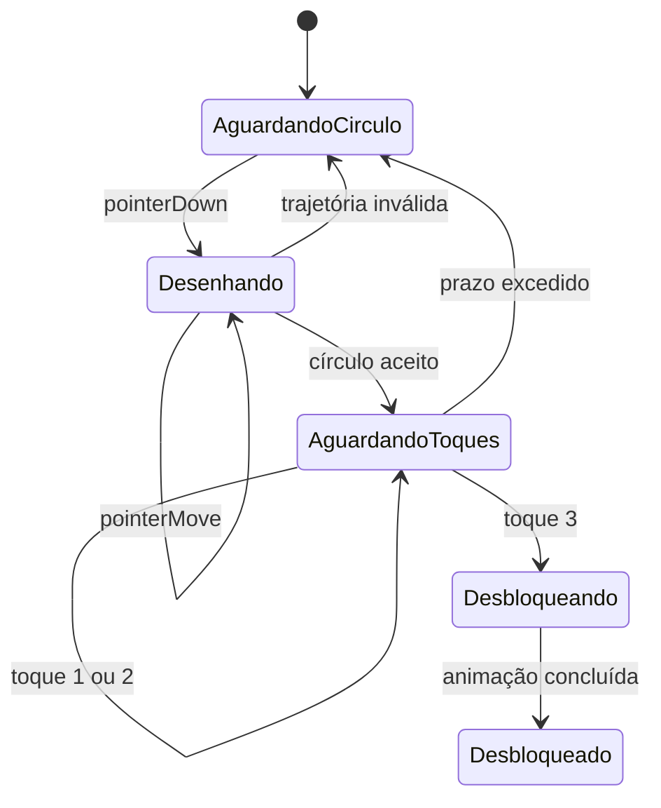

# Especificação — animação e gesto de desbloqueio

## 1. Objetivo

Na abertura, pontos e arcos dourados formam uma malha viva. O toque produz uma
onda local e atrai partículas próximas. O aplicativo entra no Núcleo quando o
usuário:

1. desenha uma trajetória aproximadamente circular com um único ponteiro;
2. solta o dedo;
3. dá três toques separados dentro do intervalo permitido.

O ritual é uma porta de experiência. Ele **não comprova identidade**. Se houver
dados privados sincronizados, o aplicativo deverá usar bloqueio do sistema,
biometria ou PIN em outra camada.

## 2. Máquina de estados



Estados e progresso pertencem a um controlador testável; o `CustomPainter`
somente renderiza o estado.

## 3. Captura da trajetória

- usar `Listener` ou `GestureDetector` em uma área de tela inteira;
- armazenar `Offset` e timestamp por amostra;
- ignorar amostras separadas por menos de 4 px para reduzir ruído;
- limitar a lista por reamostragem, nunca acumulando pontos indefinidamente;
- cancelar se um segundo ponteiro entrar, se a app perder foco ou se a
  orientação mudar;
- aplicar coordenadas normalizadas para manter o algoritmo independente do
  tamanho da tela.

## 4. Reconhecimento do círculo

Após `pointerUp`, a trajetória passa por cinco verificações. Valores abaixo são
pontos iniciais a calibrar em testes físicos, não constantes definitivas.

### 4.1 Quantidade e tamanho

- pelo menos 24 pontos reamostrados;
- comprimento total mínimo de 120 dp;
- caixa delimitadora com largura e altura mínimas de 72 dp.

### 4.2 Fechamento

Se `p0` e `pn` forem início e fim e `D` for o diâmetro médio:

```text
closure = distance(p0, pn) / D
aceitar quando closure <= 0,30
```

### 4.3 Proporção

```text
aspect = min(width, height) / max(width, height)
aceitar quando aspect >= 0,65
```

Isso permite círculos imperfeitos sem aceitar linhas muito alongadas.

### 4.4 Cobertura angular

Calcular o centroide e desembrulhar o ângulo de cada ponto. A variação angular
absoluta deve ficar aproximadamente entre `1,6π` e `2,6π`. O sentido horário ou
anti-horário é aceito. Mudanças frequentes de direção reduzem a pontuação.

### 4.5 Erro radial

Com `ri` como distância do ponto ao centroide e `r̄` como raio médio:

```text
radialError = sqrt(mean((ri - r̄)^2)) / r̄
aceitar quando radialError <= 0,32
```

### Pontuação final

Cada critério gera valor de 0 a 1. A pontuação combina fechamento (25%),
proporção (15%), cobertura (25%), erro radial (25%) e continuidade (10%). O
limiar inicial sugerido é 0,72. Além do limiar, mínimos de tamanho, cobertura e
fechamento continuam obrigatórios para evitar falsos positivos.

## 5. Três toques

- a janela começa após um círculo aceito e dura inicialmente 2,5 s;
- um toque válido tem deslocamento máximo de 18 dp e duração máxima de 250 ms;
- intervalo entre toques: 80 a 650 ms;
- qualquer toque pode ocorrer na tela; em estudo de usabilidade pode-se exigir
  proximidade do centro do círculo;
- arrasto, toque longo, quarto toque antes da transição ou expiração reinicia o
  ritual com feedback não punitivo;
- o terceiro toque dispara apenas uma transição, protegida contra reentrada.

## 6. Feedback visual e háptico

- ao desenhar: arco acompanha a trajetória, com brilho proporcional à confiança;
- círculo válido: arco se fecha e pulsa uma vez;
- cada toque: uma onda concêntrica e pulso háptico leve;
- terceiro toque: a malha converge, o núcleo expande e revela a tela principal;
- tentativa inválida: o traço se dissolve; não mostrar “senha errada”;
- háptica e som respeitam configuração do usuário e suporte da plataforma.

## 7. Acessibilidade e recuperação

- botão “Usar entrada acessível” sempre disponível após pequeno atraso;
- opção de tocar e segurar um botão por 1,5 s ou usar biometria/PIN, conforme a
  finalidade configurada;
- suporte a `Semantics`, foco de teclado e leitor de tela;
- modo reduzir movimento desativa partículas e usa contorno estático;
- após três falhas, exibir instrução curta e a alternativa, sem bloquear o uso;
- o tutorial inicial pode mostrar uma guia circular, mas pode ser ignorado.

## 8. Estrutura Flutter sugerida

```text
features/radiant_gate/
  domain/
    gate_state.dart
    gesture_sample.dart
    circle_score.dart
    circle_recognizer.dart
    tap_sequence_policy.dart
  application/
    radiant_gate_controller.dart
  presentation/
    radiant_gate_screen.dart
    radiant_field_painter.dart
    accessible_unlock_button.dart
```

O reconhecedor recebe pontos e devolve métricas puras. Isso permite testes
unitários sem relógio, tela ou engine Flutter. O controlador recebe um `Clock`
injetável para testar timeouts deterministicamente.

## 9. Testes obrigatórios

- círculo perfeito horário e anti-horário;
- círculo imperfeito, elipse moderada e trajetórias com tremor;
- linha, triângulo, espiral, rabisco, círculo muito pequeno e círculo aberto;
- dois ponteiros, interrupção, mudança de orientação e app em segundo plano;
- três toques válidos, lentos, rápidos, com arrasto e toque longo;
- tamanhos de 320 px a tablet e densidades distintas;
- modo leitor de tela e reduzir movimento;
- teste em aparelhos de entrada e intermediários com orçamento de 16,7 ms por
  quadro para 60 Hz.

## 10. Critérios de aceite

- 90% ou mais dos círculos intencionais do estudo interno são aceitos em até
  duas tentativas;
- menos de 2% das trajetórias negativas do conjunto de teste são aceitas;
- nenhum desbloqueio ocorre apenas com três toques, sem círculo válido;
- círculos horários e anti-horários têm desempenho equivalente;
- a alternativa acessível chega ao Núcleo sem executar o gesto;
- não há travamento, crescimento contínuo de memória ou dupla navegação.

