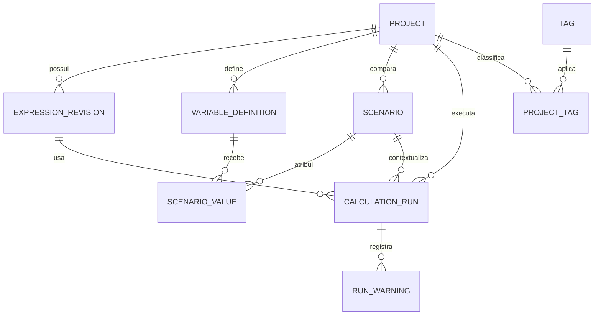

# Modelo de dados SQL — Primeiro Radiante

## 1. Objetivos

O banco local preserva projetos, expressões, variáveis, cenários e execuções. O
resultado deve ser reproduzível: além do valor, são guardadas entradas, versão
da expressão, versão do motor, política numérica e avisos.

O modelo abaixo é conceitual e compatível com SQLite. A migração para PostgreSQL
adicionará `user_id`, políticas RLS e sincronização sem transformar o aplicativo
em um cliente que executa SQL arbitrário.

## 2. Relacionamentos



## 3. Esquema conceitual

```sql
PRAGMA foreign_keys = ON;

CREATE TABLE projects (
  id TEXT PRIMARY KEY,
  title TEXT NOT NULL CHECK (length(trim(title)) BETWEEN 1 AND 120),
  description TEXT NOT NULL DEFAULT '',
  status TEXT NOT NULL DEFAULT 'active'
    CHECK (status IN ('active', 'archived')),
  created_at TEXT NOT NULL,
  updated_at TEXT NOT NULL,
  deleted_at TEXT
);

CREATE TABLE expression_revisions (
  id TEXT PRIMARY KEY,
  project_id TEXT NOT NULL REFERENCES projects(id),
  revision_number INTEGER NOT NULL CHECK (revision_number > 0),
  source_text TEXT NOT NULL,
  ast_json TEXT NOT NULL,
  parser_version TEXT NOT NULL,
  created_at TEXT NOT NULL,
  UNIQUE (project_id, revision_number)
);

CREATE TABLE variable_definitions (
  id TEXT PRIMARY KEY,
  project_id TEXT NOT NULL REFERENCES projects(id),
  symbol TEXT NOT NULL,
  label TEXT NOT NULL,
  value_type TEXT NOT NULL
    CHECK (value_type IN ('integer', 'decimal', 'real', 'quantity')),
  unit_code TEXT,
  default_value_json TEXT,
  constraints_json TEXT NOT NULL DEFAULT '{}',
  sort_order INTEGER NOT NULL DEFAULT 0,
  UNIQUE (project_id, symbol)
);

CREATE TABLE scenarios (
  id TEXT PRIMARY KEY,
  project_id TEXT NOT NULL REFERENCES projects(id),
  name TEXT NOT NULL,
  color_argb INTEGER,
  created_at TEXT NOT NULL,
  updated_at TEXT NOT NULL,
  UNIQUE (project_id, name)
);

CREATE TABLE scenario_values (
  scenario_id TEXT NOT NULL REFERENCES scenarios(id) ON DELETE CASCADE,
  variable_id TEXT NOT NULL REFERENCES variable_definitions(id),
  value_json TEXT NOT NULL,
  PRIMARY KEY (scenario_id, variable_id)
);

CREATE TABLE calculation_runs (
  id TEXT PRIMARY KEY,
  project_id TEXT NOT NULL REFERENCES projects(id),
  expression_revision_id TEXT NOT NULL REFERENCES expression_revisions(id),
  scenario_id TEXT REFERENCES scenarios(id),
  status TEXT NOT NULL
    CHECK (status IN ('success', 'invalid', 'failed', 'cancelled')),
  input_snapshot_json TEXT NOT NULL,
  result_json TEXT,
  numeric_policy_json TEXT NOT NULL,
  engine_version TEXT NOT NULL,
  duration_micros INTEGER NOT NULL CHECK (duration_micros >= 0),
  random_seed TEXT,
  error_code TEXT,
  created_at TEXT NOT NULL
);

CREATE TABLE run_warnings (
  id TEXT PRIMARY KEY,
  calculation_run_id TEXT NOT NULL
    REFERENCES calculation_runs(id) ON DELETE CASCADE,
  code TEXT NOT NULL,
  message TEXT NOT NULL,
  details_json TEXT NOT NULL DEFAULT '{}'
);

CREATE TABLE tags (
  id TEXT PRIMARY KEY,
  name TEXT NOT NULL COLLATE NOCASE UNIQUE
);

CREATE TABLE project_tags (
  project_id TEXT NOT NULL REFERENCES projects(id) ON DELETE CASCADE,
  tag_id TEXT NOT NULL REFERENCES tags(id) ON DELETE CASCADE,
  PRIMARY KEY (project_id, tag_id)
);

CREATE TABLE app_settings (
  key TEXT PRIMARY KEY,
  value_json TEXT NOT NULL,
  updated_at TEXT NOT NULL
);

CREATE INDEX idx_projects_updated ON projects(updated_at DESC)
  WHERE deleted_at IS NULL;
CREATE INDEX idx_revisions_project ON expression_revisions(project_id, revision_number DESC);
CREATE INDEX idx_runs_project_created ON calculation_runs(project_id, created_at DESC);
```

## 4. Regras de persistência

- UUIDs são gerados na aplicação, nunca derivados do título;
- datas são UTC em ISO 8601 com precisão consistente;
- JSON possui schema e versão validados pela camada de dados;
- expressões executadas apontam para revisão imutável;
- exclusão de projeto é lógica se sincronização estiver habilitada;
- uma transação salva revisão, execução, resultado e avisos;
- valores decimais ficam serializados como string + escala, não como `REAL`;
- unidades ficam em códigos canônicos e a apresentação localizada é separada;
- histórico pode ter política de retenção configurável, sem apagar favoritos ou
  revisões referenciadas.

### Implementação inicial no aplicativo

O primeiro incremento persistido usa `primeiro_radiante.db` no armazenamento
local e cria as tabelas `projects`, `scenarios` e `calculation_runs`. O projeto
`default` é criado na abertura do banco. Cada execução guarda o nome do cenário,
tipo de análise, entradas em JSON, texto do resultado, série de valores e data
UTC. A evolução para o esquema completo acima deve ser feita por migração
incremental.

## 5. Extensão futura para PostgreSQL

Adicionar, no mínimo:

- `owner_user_id uuid not null` em entidades raiz;
- `created_by` e `updated_by` quando houver colaboração;
- `sync_version bigint` ou controle equivalente;
- RLS baseada em `auth.uid()` e testes de acesso cruzado;
- funções transacionais para alteração de membros e compartilhamento;
- auditoria de ações administrativas;
- criptografia/segregação adequada para conteúdo sensível.

O cliente não recebe chave administrativa. Funções de IA e importações pesadas
passam por APIs com autenticação, validação, limite e idempotência.

## 6. Migrações e testes

- toda alteração de schema cria migração incremental e teste de upgrade;
- testar banco novo, banco da versão anterior e falha no meio da migração;
- criar backup antes de migração destrutiva e validar restauração;
- `PRAGMA foreign_key_check` e `PRAGMA integrity_check` fazem parte do diagnóstico;
- fixtures usam resultados determinísticos e não dependem do relógio real;
- exportações carregam `schemaVersion` e `engineVersion`.

