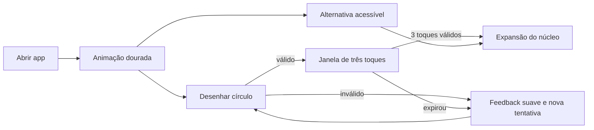
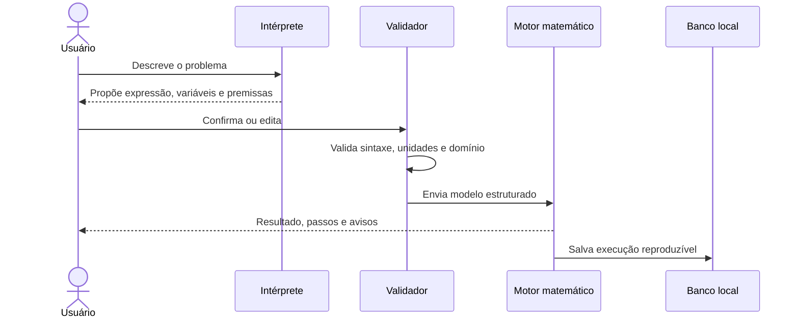

# Planejamento do produto — Primeiro Radiante

## 1. Visão

O Primeiro Radiante será um laboratório matemático visual. O usuário descreve
um problema, monta variáveis, executa cálculos, compara cenários e entende como
o resultado foi obtido. A interface representa fórmulas e relações como uma
rede dourada navegável, inspirada no imaginário de um artefato científico
avançado, sem prometer a psicohistória fictícia como tecnologia real.

### Proposta de valor

- reunir calculadora científica, álgebra, estatística e cenários em um espaço;
- mostrar fórmulas, unidades, premissas e passos verificáveis;
- permitir que uma camada de IA transforme linguagem natural em um rascunho de
  cálculo que o usuário confirma antes da execução;
- preservar projetos e versões para que resultados possam ser reproduzidos;
- tornar relações complexas exploráveis por uma visualização espacial simples.

### Princípios

1. **Correto antes de impressionante:** animação nunca esconde valor, erro ou
   premissa.
2. **IA propõe, o usuário confirma:** nenhuma expressão gerada é executada como
   se fosse confiável sem revisão visível.
3. **Resultado rastreável:** entrada, unidade, expressão, versão do motor e data
   acompanham cada execução.
4. **Local-first:** o núcleo funciona sem conta e sem internet.
5. **Acessível:** todo gesto possui alternativa por botão e leitores de tela não
   dependem da visualização gráfica.
6. **Humildade científica:** simulações mostram intervalos e incerteza; não
   fabricam previsões determinísticas sobre pessoas ou sociedades.

## 2. Públicos

### Estudante

Quer entender etapas, validar exercícios e visualizar relações entre variáveis.
Precisa de explicações graduais e não de uma resposta opaca.

### Profissional técnico

Quer salvar fórmulas, trabalhar com unidades, comparar cenários e exportar um
registro confiável do cálculo.

### Usuário curioso

Quer formular perguntas em linguagem natural e explorar “o que aconteceria se”
sem aprender previamente a sintaxe do motor.

O MVP não será certificado para decisões médicas, financeiras, estruturais ou
de segurança. Esses domínios exigem validação e avisos específicos em fases
posteriores.

## 3. Escopo do MVP

### Incluído

- animação inicial dourada reativa ao toque;
- ritual de desbloqueio por círculo e três toques, com alternativa acessível;
- calculadora científica com histórico;
- editor de expressões com variáveis e unidades;
- funções aritméticas, trigonométricas, logarítmicas e estatísticas básicas;
- resolução numérica simples e validação de domínio;
- projetos, cenários e versões salvos localmente;
- comparação tabular e gráfica de cenários;
- “Intérprete Seldon”: linguagem natural para rascunho estruturado, se uma
  configuração de IA estiver disponível;
- explicação dos passos gerada a partir da árvore da expressão;
- exportação de um resumo em texto/JSON; PDF fica como melhoria posterior;
- configurações de animação, háptica, som, acessibilidade e privacidade.

### Fora do MVP

- previsão real de comportamento coletivo ou eventos históricos;
- sistema algébrico computacional completo;
- colaboração simultânea;
- marketplace de fórmulas;
- execução arbitrária de Dart, Python ou SQL inserido pelo usuário;
- treinamento de modelo de IA no dispositivo;
- armazenamento obrigatório em nuvem;
- autenticação pelo gesto visual.

## 4. Mapa de telas

```text
Inicialização
  └─ Câmara Radiante / desbloqueio
      ├─ alternativa acessível
      └─ Núcleo
          ├─ Novo cálculo
          ├─ Projetos
          │   └─ Projeto
          │       ├─ Expressão
          │       ├─ Variáveis e unidades
          │       ├─ Cenários
          │       ├─ Visualização
          │       └─ Histórico/versões
          ├─ Assistente
          ├─ Biblioteca de funções
          └─ Configurações
```

### Núcleo

Exibe projetos recentes, ação “Novo cálculo”, favoritos e uma malha dourada
discreta. A interface deve continuar legível em 320 px e não usar a animação
como navegação exclusiva.

### Bancada de cálculo

- editor da expressão;
- teclado numérico/científico adaptativo;
- lista de variáveis com valor, unidade, intervalo e descrição;
- resultado com precisão, unidade, alertas e ações;
- abas de passos, gráfico, cenários e metadados;
- desfazer/refazer e indicador explícito de alterações não salvas.

### Visualização Radiante

Nós representam variáveis, operações e resultados; arestas representam
dependências. Toque seleciona, arrasto move a câmera, pinça altera zoom. Uma
visão em lista oferece a mesma informação de forma acessível.

## 5. Fluxos principais

### Primeira abertura



### Cálculo assistido



## 6. Requisitos funcionais

| ID | Requisito | Prioridade |
|---|---|---|
| RF-01 | Reagir visualmente a toque/arrasto na abertura | P0 |
| RF-02 | Reconhecer círculo e depois exatamente três toques válidos | P0 |
| RF-03 | Oferecer entrada alternativa configurável e acessível | P0 |
| RF-04 | Criar, renomear, duplicar, arquivar e excluir projeto | P0 |
| RF-05 | Analisar expressão sem executar código arbitrário | P0 |
| RF-06 | Validar unidades e domínios matemáticos | P0 |
| RF-07 | Registrar entradas, resultado, erros e versão do motor | P0 |
| RF-08 | Criar e comparar cenários | P0 |
| RF-09 | Exibir árvore/dependências e visão acessível equivalente | P1 |
| RF-10 | Converter texto natural em proposta revisável | P1 |
| RF-11 | Funcionar sem internet, exceto recursos declaradamente online | P0 |
| RF-12 | Exportar e importar projetos com versão de esquema | P1 |

## 7. Requisitos não funcionais

| Tema | Meta inicial |
|---|---|
| Inicialização | primeiro quadro útil em até 1,5 s em aparelho intermediário |
| Gesto | resposta visual ao toque abaixo de 50 ms |
| Cálculo | expressões comuns abaixo de 100 ms, fora animação |
| Estabilidade | nenhuma entrada inválida encerra o aplicativo |
| Precisão | política configurável; nunca usar `double` para valores decimais exatos sem aviso |
| Offline | projetos e motor P0 integralmente disponíveis |
| Acessibilidade | contraste AA, texto escalável, redução de movimento e alternativa ao gesto |
| Privacidade | nenhum projeto enviado à IA sem ação e consentimento explícitos |
| Compatibilidade | Android e iOS; web e desktop não fazem parte do produto |

## 8. Linguagem visual

- fundo quase preto, com profundidade em azul/petróleo;
- ouro principal sugerido: `#D8B65C`; ouro luminoso: `#FFD978`;
- texto principal marfim: `#F5F0E6`;
- erro não depende só de vermelho: usa ícone, rótulo e descrição;
- partículas e linhas são procedurais, com limite de densidade e qualidade
  adaptativa;
- tipografia de interface altamente legível; símbolos matemáticos usam fonte
  com cobertura adequada;
- modo “reduzir movimento” substitui expansões e partículas por transições
  curtas de opacidade.

## 9. Camada inteligente

O termo “inteligente” será implementado em duas camadas:

1. **Inteligência determinística local:** parser, inferência de dependências,
   unidades, análise de domínio, simplificações seguras, cenários e explicação
   derivada da árvore de sintaxe.
2. **Assistência generativa opcional:** transforma texto em um contrato JSON
   estrito. A resposta nunca contém código executável e passa por validação local.

Contrato conceitual da IA:

```json
{
  "expression": "principal * pow(1 + rate, periods)",
  "variables": [
    {"name": "principal", "type": "decimal", "unit": "BRL"},
    {"name": "rate", "type": "decimal", "unit": "1"},
    {"name": "periods", "type": "integer", "unit": "1"}
  ],
  "assumptions": ["capitalização por período"],
  "questions": []
}
```

O aplicativo mostra esse conteúdo antes do cálculo. Se unidade, tipo ou função
não forem permitidos, o rascunho é rejeitado ou corrigido pelo usuário.

## 10. Métricas de produto

- taxa de conclusão do desbloqueio e uso da alternativa;
- tempo até o primeiro cálculo correto;
- percentual de cálculos com erro de sintaxe/unidade;
- projetos revisitados em 7 e 30 dias;
- propostas de IA editadas antes da execução;
- falhas/crashes por mil sessões;
- tempo mediano e percentil 95 de cálculo.

Telemetria será opt-in quando envolver conteúdo ou expressões do usuário. O
evento padrão deve preferir contagens e tempos, não fórmulas completas.

## 11. Riscos e respostas

| Risco | Resposta planejada |
|---|---|
| Confusão entre ficção e ciência | linguagem explícita, exemplos educacionais e incerteza visível |
| Resultado errado da IA | execução apenas pelo motor validado e revisão obrigatória |
| Erro numérico | tipos adequados, testes contra referências e metadados de precisão |
| Gesto frustrante | tolerâncias calibradas, feedback, tutorial e alternativa |
| Baixo desempenho da animação | orçamento por quadro, qualidade adaptativa e redução de movimento |
| Contaminação entre produtos | repositório, banco, dependências e pipeline totalmente separados |
| Propriedade intelectual | identidade original e revisão de nome/branding antes do lançamento |
